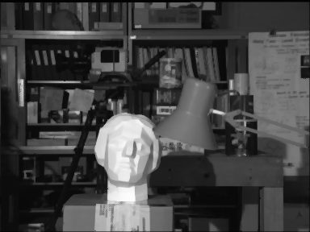

# Image Denoising Algorithms in MATLAB

Image Denoising Algorithms in MATLAB. It includes implementations of Block Matching, Belief Propagation and ICM (Iterated Conditional Modes).

## Results

### Noisy Image

### Block Matching

### Belief Propagation

### ICM

